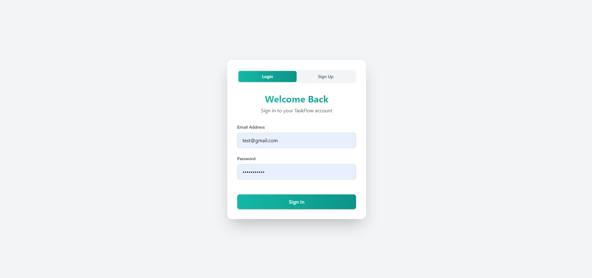
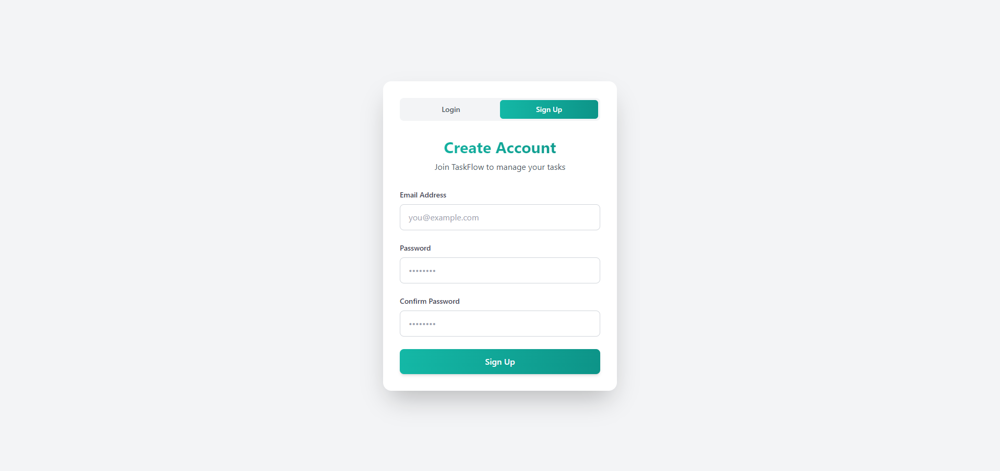
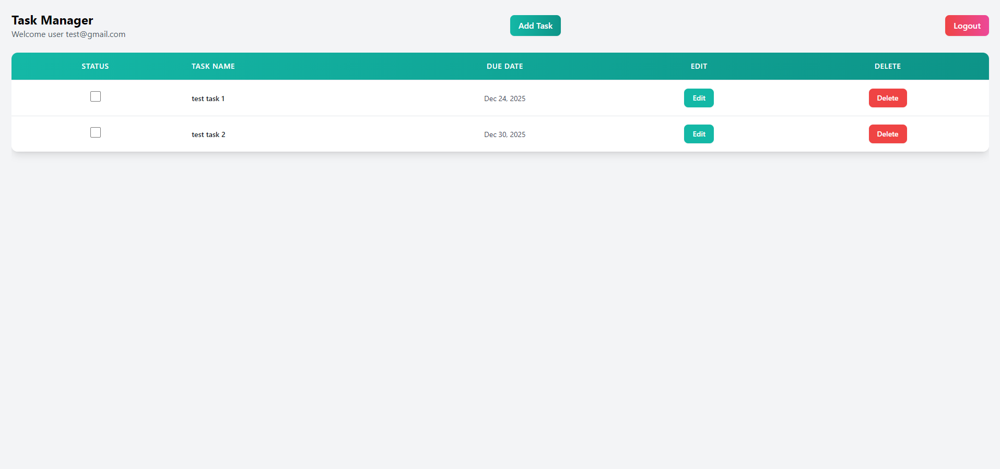
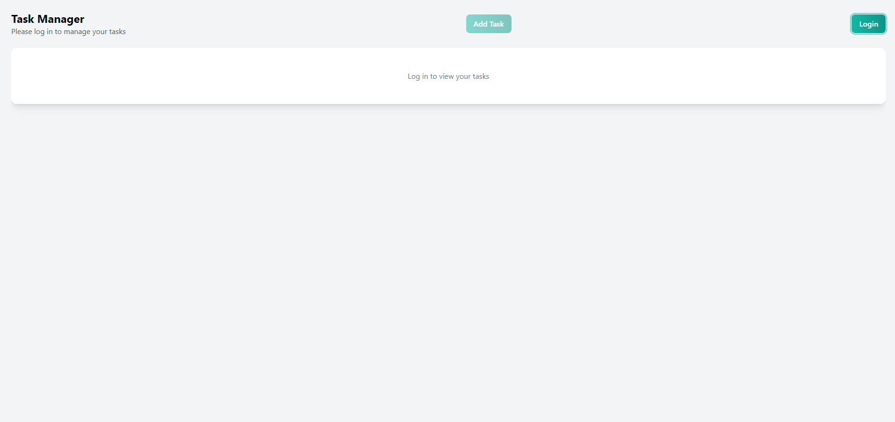

# TaskFlow

TaskFlow is a full-stack task management application built with React (Vite), ASP.NET Core, and Entity Framework Core. It features JWT authentication, a modern UI, and a robust backend ready for cloud deployment.

---

## 🚀 Features

- User registration and login with JWT authentication
- Create, edit, complete, and delete tasks
- Due date support and task sorting
- Responsive, modern UI (React + Tailwind CSS)
- Secure backend API (ASP.NET Core)
- Entity Framework Core for database access
- Ready for deployment to cloud platforms

---

## 🛠️ Tech Stack

- **Frontend:** React (Vite), TypeScript, Tailwind CSS, Axios
- **Backend:** ASP.NET Core, Entity Framework Core, JWT Auth
- **Database:** SQL Server (local dev), easily swappable for PostgreSQL or Azure SQL

---

## 📦 Project Structure

```
/frontend   # React app (Vite)
/backend    # ASP.NET Core API
```

---

## 🖥️ Local Development

### Prerequisites

- Node.js & npm
- .NET 8 SDK
- SQL Server (or PostgreSQL, with minor changes)

### Setup

1. **Clone the repo:**

   ```bash
   git clone https://github.com/Anthonyjrchen/TaskFlow.git
   cd TaskFlow
   ```

2. **Backend:**

   - Update your connection string in `backend/TaskFlow.Api/appsettings.Development.json`
   - Run migrations:
     ```bash
     cd backend/TaskFlow.Api
     dotnet ef database update
     dotnet run
     ```

3. **Frontend:**
   - Set API URL in `frontend/.env`:
     ```
     VITE_API_URL=http://localhost:5000/api
     ```
   - Start the dev server:
     ```bash
     cd frontend
     npm install
     npm run dev
     ```

---

## 🌐 Deployment

### Frontend

- **Recommended:** [Netlify](https://www.netlify.com/) or [Vercel](https://vercel.com/)
- **Build command:** `npm run build`
- **Publish directory:** `dist`

### Backend

- **Recommended:** [Render](https://render.com/) (Docker), Azure App Service, or any .NET-compatible host
- **Dockerfile** included in `backend/TaskFlow.Api`
- **Set environment variables** (connection string, JWT secret) in your host’s dashboard

### Database

- **Local:** SQL Server or PostgreSQL
- **Cloud:** Azure SQL, Render PostgreSQL, Neon, Supabase, Railway, etc.

---

## 💡 About Database Hosting

> **Note:**  
> For this project, I used a local SQL Server database during development to avoid recurring costs associated with cloud database hosting.  
> The backend is fully ready for deployment with any managed SQL provider (Azure SQL, PostgreSQL on Render, etc.)—just update the connection string and run migrations.
>
> If deploying to a free cloud database, be aware that most providers have time or usage limits. For production or long-term use, upgrading to a paid plan or self-hosting is recommended.
>
> This approach demonstrates my ability to build scalable, cloud-ready applications while being mindful of cost.

---

## 📝 How to Switch Database Providers

1. **Install the appropriate EF Core provider** (e.g., `Npgsql.EntityFrameworkCore.PostgreSQL` for PostgreSQL)
2. **Update `Program.cs`** to use `UseNpgsql` or `UseSqlServer`
3. **Update your connection string**
4. **Run migrations** to create tables in the new database

---

## 📚 Screenshots

### Login Page



### Sign Up Page



### Dashboard (Logged In)



### Dashboard (Logged Out)



---

## 📄 License

MIT

---

## 🙋‍♂️ Questions?

Open an issue or contact [Anthonyjrchen](https://github.com/Anthonyjrchen) on GitHub.
